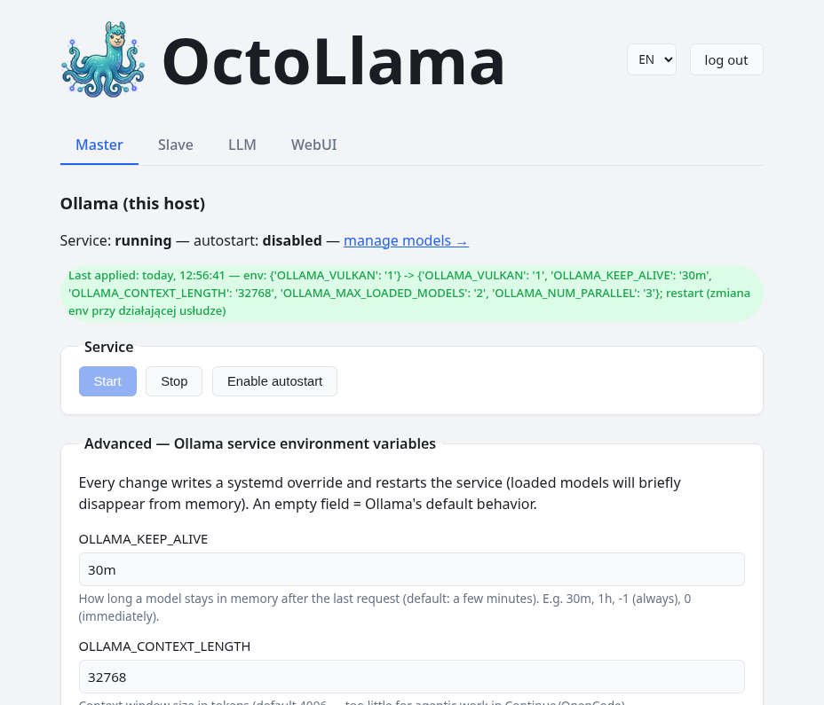

# OctoLlama

<p align="center"></p>

Panel WWW do zarządzania [Ollamą](https://ollama.com), agregatorem
[LiteLLM](https://www.litellm.ai/) i [Open WebUI](https://openwebui.com/) na
wielu hostach w domowej sieci — bez okienek, logowanie, dostępny z
przeglądarki (też z telefonu). Odpowiednik funkcji desktopowej aplikacji
[Ollama Manager](https://github.com/cyryllo/Ollama-manager) (PyQt6/KDE), tylko
sterowany przez WWW.

<p align="center"></p>

## Funkcje

- **Sterowanie usługą Ollama** — start/stop/autostart, instalacja na żądanie,
  wszystkie zmienne środowiskowe wpływające na wydajność (kontekst, VRAM,
  Vulkan/iGPU, KV-cache, dostępność w sieci).
- **Zarządzanie modelami** — lista, rozmiar, co jest aktualnie w pamięci,
  pobieranie nowych modeli z paskiem postępu, usuwanie.
- **Agregator LiteLLM** — jeden endpoint (OpenAI-kompatybilny) nad modelami ze
  wszystkich hostów naraz; świadomy wybór, które modele mają być wystawione.
- **Open WebUI** — panel czatu podpięty pod LiteLLM (nie pod pojedynczy host),
  widzi dokładnie te modele, które wybrałeś do wystawienia.
- **Config dla Continue.dev** (VS Code) — generowany z aktualnie wystawionych
  modeli, do ręcznego wklejenia (panel nigdy nie nadpisuje configu użytkownika).
- **Wielohostowość** — dodawanie zdalnych hostów (np. mini-PC z Ollamą) z
  automatycznym wygenerowaniem instalatora dla nowej maszyny.
- **Zarządzanie zasilaniem hostów** — Wake-on-LAN do wybudzania uśpionego/
  wyłączonego hosta, plus zdalne wyłączanie/restart/uśpienie.
- **Logowanie** — jeden użytkownik, hash hasła w lokalnym pliku, bez bazy danych.
- **Wielojęzyczność** — polski i angielski (przełącznik w nagłówku), łatwe do
  rozszerzenia o kolejne języki.

## Jak to działa

Zmiany w usłudze systemd (start/stop, zmienne środowiskowe) wymagają uprawnień
roota. Zamiast dawać je panelowi WWW, każdy host uruchamia dwa oddzielne procesy:

```
┌─────────────────────────────┐         ┌──────────────────────────────┐
│  octollama-web              │         │  octollama-daemon            │
│  (user, BEZ roota)          │         │  (root, systemd system unit)  │
│                              │         │                                │
│  - panel WWW + logowanie    │         │  - inotify na plik stanu       │
│  - operacje na modelach     │  plik   │  - diff: co się zmieniło        │
│    -> bezpośrednio /api/... │ stanu   │  - override.conf + reload/     │
│    (bez roota)              │ ──────► │    restart/enable/disable       │
│  - zapisuje "co user chce"  │ (JSON)  │  - zapisuje status.json z       │
│    do pliku stanu           │ ◄────── │    wynikiem (OK/błąd)           │
└─────────────────────────────┘ status  └──────────────────────────────┘
                                 .json
```

Panel WWW nigdy nie woła `systemctl` bezpośrednio — zapisuje docelowy stan do
`state.json`, a lokalny root-owy demon go stosuje i raportuje wynik w
`status.json`. Jedyny kontakt roota ze światem to plik na dysku, zero portu
sieciowego. Operacje niewymagające roota (modele przez `/api/...`, LiteLLM
przez `systemd --user`) idą bezpośrednio z panelu.

Dodanie zdalnego hosta (np. mini-PC) działa podobnie: host zarządzający jest
serwerem NFS, eksportuje osobny katalog per host (ograniczony do jego IP), a
panel generuje gotowy skrypt instalacyjny z wklejonym kodem demona — do
uruchomienia raz, ręcznie, na nowej maszynie.

## Wymagania

- Linux z `systemd` (Debian/Ubuntu — instalator używa `apt`).
- Python 3.11+.
- Uprawnienia `sudo` (do instalacji demona, NFS, zależności systemowych).

## Instalacja

Na hoście, który ma być "mastera" (tym, na którym stoi panel WWW):

```bash
git clone git@github.com:cyryllo/OctoLlama.git
cd OctoLlama
./install.sh
```

Skrypt instaluje (pomijając to, co już jest zainstalowane):

1. Ollamę (oficjalny installer z ollama.com),
2. LiteLLM (`uv tool install litellm[proxy]`, bez roota),
3. Open WebUI (`uv tool install --python 3.11 open-webui`, bez roota — sama
   binarka, uruchomienie zostaje na przycisk w zakładce WebUI panelu),
4. `nfs-kernel-server` (do obsługi zdalnych hostów),
5. `octollama-daemon` — systemowa usługa `systemd` (root),
6. `octollama-web` — usługa `systemd --user`, panel WWW (przy pierwszej
   instalacji pyta o port, domyślnie 5000 — wystarczy Enter, żeby przyjąć).

Przy pierwszej instalacji skrypt też zapyta o login/hasło (hasło wpisywane
dwa razy, dla pewności). Żeby zmienić dane logowania później, uruchom to
ręcznie:

```bash
cd ~/.local/share/octollama-web
./.venv/bin/python3 manage_users.py
```

Panel będzie dostępny pod `http://<adres-tego-hosta>:<port>` (port, który
wybrałeś, albo domyślnie 5000). Zarówno port, jak i dane logowania są pytane
tylko raz — ponowne uruchomienie instalatora przy aktualizacji ich nie zresetuje.

### Aktualizacja

`git pull`, potem ponownie `./install.sh`. Skrypt wykrywa zainstalowaną wersję
(z pliku `VERSION`) i porównuje z tą w Twoim katalogu:

- **starsza zainstalowana** — proponuje aktualizację (domyślnie: tak),
- **ta sama wersja** — pyta przed ponowną instalacją (domyślnie: nie),
- **nowsza zainstalowana** — ostrzega przed nadpisaniem jej starszą.

### Odinstalowanie

```bash
./install.sh --uninstall
```

Zawsze usuwa własnego demona i panel WWW OctoLlama (usługi, unit-y,
zainstalowane pliki), a potem pyta osobno — domyślnie **nie** przy każdym —
czy usunąć też: katalog stanu i eksporty NFS dla zdalnych hostów, LiteLLM,
Open WebUI, Ollamę (**to usuwa WSZYSTKIE pobrane modele**) oraz
`nfs-kernel-server`. Nic poza samym OctoLlama nie zostanie usunięte bez
Twojej zgody.

## Zarządzanie usługami

Instalują się dwie niezależne usługi — demon (system, root) i panel WWW
(user, bez roota):

```bash
# octollama-daemon (root, usługa systemowa)
sudo systemctl status octollama-daemon
sudo systemctl restart octollama-daemon
sudo systemctl stop octollama-daemon
sudo systemctl start octollama-daemon
sudo journalctl -u octollama-daemon -f      # log na żywo

# octollama-web (usługa usera, bez sudo)
systemctl --user status octollama-web
systemctl --user restart octollama-web
systemctl --user stop octollama-web
systemctl --user start octollama-web
journalctl --user -u octollama-web -f       # log na żywo
```

Restart panelu WWW **nie** wpływa na samą usługę Ollama — demon nadal
wymusza ostatni stan otrzymany z `state.json`, niezależnie od tego, czy panel
akurat działa. Zatrzymanie demona oznacza, że zmiany zrobione w panelu
(start/stop/zmienne env) nie zostaną zastosowane, dopóki znowu nie zadziała.

## Użycie

Panel ma cztery zakładki:

- **Master** — usługa Ollama i jej zmienne środowiskowe na tym hoście, status
  wszystkich podłączonych hostów, link do zarządzania modelami.
- **Slave** — dodawanie/usuwanie zdalnych hostów Ollamy. Po dodaniu hosta
  panel generuje `install-<nazwa>.sh` — pobierz i uruchom go (przez SSH) na
  docelowej maszynie; instaluje Ollamę, montuje stan przez NFS i stawia
  swojego demona. Też Wake-on-LAN (adres MAC wykrywany automatycznie z ARP,
  gdy host jest osiągalny, albo wpisywany ręcznie) i zdalne wyłączanie/
  restart/uśpienie per host.
- **LLM** — start/stop agregatora LiteLLM, wybór które modele z których
  hostów mają być wystawione, generowanie configu dla Continue.dev, a także
  ustawienia balansowania obciążenia i niezawodności (patrz niżej).
- **WebUI** — start/stop Open WebUI, podpiętego pod LiteLLM (widzi te same,
  świadomie wybrane modele, ze wszystkich hostów naraz).

### Balansowanie obciążenia i niezawodność (zakładka LLM)

Gdy ten sam model (ta sama nazwa i tag, np. `qwen2.5-coder:14b`) jest
wystawiony na więcej niż jednym hoście, LiteLLM sam rozkłada między nie
ruch — panel pokazuje to jako „zbalansowany na N hostach". Do tego zakładka
LLM udostępnia wbudowane w LiteLLM mechanizmy niezawodności:

- **Strategia routingu** — jak LiteLLM wybiera hosta spośród zbalansowanych:
  `simple-shuffle` (losowo, domyślnie), `least-busy`,
  `latency-based-routing`, `usage-based-routing-v2`.
- **Priorytet hostów** — opcjonalna kolejność per host dla zbalansowanego
  modelu (niższa liczba = wyższy priorytet). Puste pole = czyste
  balansowanie bez preferowanego hosta.
- **Fallbacki** — opcjonalny model zapasowy dla każdego wystawionego modelu,
  używany, gdy podstawowy zawiedzie.
- **Retry / timeout / cooldown** — `num_retries`, `timeout` żądania,
  `cooldown_time` oraz `allowed_fails` przed czasowym wychłodzeniem hosta.
- **Fallback przy przekroczeniu kontekstu** (checkbox) — gdy włączony,
  zapytanie przekraczające okno kontekstu małego modelu automatycznie
  ponawia próbę na wskazanym większym modelu.

Te ustawienia trzymane są w `web/litellm_ustawienia.json` (niecommitowany,
ten sam wzorzec co `hosts.json`). Zapis od razu restartuje działającą usługę
LiteLLM z nowym configiem, tak samo jak wybór modeli wyżej. Generator scala własne wpisy
`model_list`/`router_settings`/`litellm_settings` do `litellm_config.yaml`
(oznaczając swoje wpisy modeli przez `model_info.managed_by: octollama`)
zamiast nadpisywać cały plik, więc ręczne dopiski do tego pliku (np. model
innego providera z własnym kluczem API, `general_settings`) przetrwają
kolejne restarty.

## Struktura repo

```
daemon/
  octollama_daemon.py   Root-owy demon (systemd system unit)
  systemd/                   Jednostka systemd dla demona
web/
  app.py                     Trasy / logika widoków (Flask)
  ollama_client.py           Klient REST API Ollamy (modele)
  litellm_manager.py         Sterowanie LiteLLM + config Continue.dev
  litellm_ustawienia.py      Przechowywanie ustawień routingu/fallbacków LiteLLM
  openwebui_manager.py       Sterowanie Open WebUI (podpięte pod LiteLLM)
  hosts_store.py             Lista hostów (zakładka Slave)
  install_generator.py       Generator instalatora dla zdalnego hosta
  wol.py                     Wake-on-LAN (magic packet)
  state_store.py             Odczyt/zapis state.json / status.json
  pobierania.py              Śledzenie pobierania modeli w tle
  i18n.py                    Tłumaczenia (_(), wybór języka w sesji)
  lang/en.json               Słownik tłumaczeń angielskich
  templates/                 Szablony Jinja
  static/style.css           Style (jasny/ciemny motyw)
install.sh                   Instalator dla hosta zarządzającego
```

## Dodanie kolejnego języka

Ten sam wzorzec co [Ollama Manager](https://github.com/cyryllo/Ollama-manager)
(`lang/*.json` kluczowane polskim tekstem źródłowym): utwórz
`web/lang/<kod>.json` z tłumaczeniami, dopisz `"<kod>": "nazwa"` do `JEZYKI`
w `web/i18n.py`. Brak wpisu w słowniku = panel pokazuje oryginał (polski), więc
niepełne tłumaczenie nigdy nie zostawia pustego miejsca.

## Status

Działający szkielet — sterowanie usługą, modele, LiteLLM, Open WebUI, config
Continue.dev, wielohostowość (NFS + generator instalatora) i zarządzanie
zasilaniem hostów (Wake-on-LAN + zdalne wyłączanie/restart/uśpienie) działają
end-to-end. Ścieżka NFS/zdalny demon nie była jeszcze zweryfikowana na żywym
sprzęcie. Świadomie pominięte: TLS (do zapewnienia przez reverse proxy przed
panelem).

## Powiązane projekty

- [Ollama Manager](https://github.com/cyryllo/Ollama-manager) — aplikacja
  desktopowa PyQt6/KDE, źródło logiki sterowania usługą/modelami/LiteLLM
  przeniesionej tutaj.

## Licencja

[GNU GPLv3](LICENSE) — ten projekt zawiera logikę przeniesioną z
[Ollama Managera](https://github.com/cyryllo/Ollama-manager) (GPLv3), więc
dziedziczy tę samą licencję.
